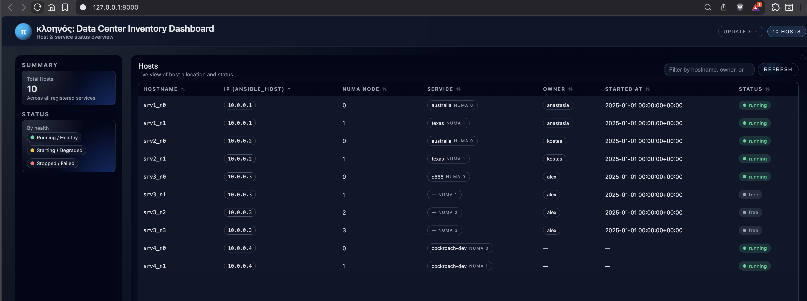
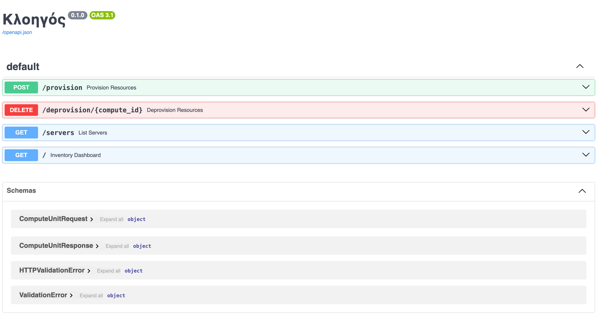

# Kloigos | Κλοηγός

Ultrasimple micro CMDB for managing local servers



## Setup

This is a very simple [FastAPI](https://fastapi.tiangolo.com/) app.

For local testing:

- clone the repo
- install requirements using `poetry install`
- recreate the SQLite database file from the dump

    ```bash
    sqlite3 kloigos.sqlite < kloigos.sql
    ```

- run the FastAPI server in dev mode using

    ```bash
    fastapi dev kloigos/main.py 
    ```

Consult the FastAPI docs for the production deployment guide.

---

## API

Consult the API Swagger UI page at </docs> for info on all endpoints



