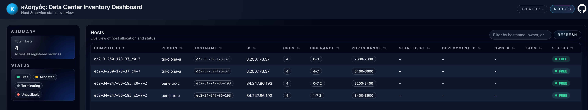

# Kloigos | Κλοηγός

Ultrasimple micro [CMDB](https://en.wikipedia.org/wiki/Configuration_management_database) for managing local servers.

The name comes from the Greek word **πλοηγός** (ploigos), which means "navigator", but substituting **π** (Pi) with **Κ** (Kappa), so **Κλοηγός**.



## What problem it solves

Imagine you manage a fleet of large servers-machines with 64 or 128 CPUs, spread across 1, 2, or even 4 NUMA nodes.

You can use each server to run a single application that consumes all available CPUs, or you can partition the CPUs into smaller _compute units_ so that multiple applications can share the same machine.

For example, on a 64-CPU server, you might split the system into two 32-CPU compute units.

The most common way to achieve this today is by introducing a virtualization layer, such as a hypervisor to run multiple virtual machines, or a container orchestrator like Kubernetes. These solutions are mature, feature-rich, and well supported. However, they also come with costs: licensing fees, operational complexity, and non-trivial CPU overhead to run the virtualization or orchestration layer itself.

This is where **Kloigos** offers an alternative approach.

Kloigos lets you manage compute units directly on the host, without introducing an additional abstraction layer. Each compute unit is identified by a combination of the hostname and a specific CPU range, and is treated as an independent execution environment. You can install and run any software you like within each compute unit.

Because Kloigos relies on native Linux primitives, it introduces no extra runtime overhead and requires no special software stack. Processes are launched using `numactl` to bind them to the designated CPUs.

This approach does impose some constraints. For example, services that expose network ports must avoid port collisions. To address this, each compute unit is assigned:

- a dedicated CPU range,
- a reserved port range,
- a dedicated directory in the filesystem.

For example, imagine you have a 32 CPUs server, `host1`, and decide you want to make 2x 16 CPUs compute units out of it, using CPUs 0-15 for one, and 16-31 for the other.

These compute units will be identified as:

```yaml
compute_id: host1_0-15
hostname: host1
cpu_range: 0-15
ports_range: 2000-2200
dir: c0-15
```

```yaml
compute_id: host1_16-31
hostname: host1
cpu_range: 16-31
ports_range: 2200-2400
dir: c16-31
```

So if you deploy `serviceA` on `host1_0-15`, you will install any binaries at `/opt/c0-15/` and make that service available at port, say, `2047`.
The service will be started using `numactl --physcpubind 0-15 /opt/c0-15/serviceA -p 2047 ....`.

Conversely, another instance of `serviceA` running on `host1_16-31` will install binaries at `/opt/c16-31/` and use port `2247`, and start the service
using `numactl --physcpubind 16-31 /opt/c16-31/serviceA -p 2247 ...`.

You can decide to allocate dedicated disks for the data of a service.
The same idea remains, namely, prepending each path with the unit identifier, example `/mnt/c0-15/data`.

Kloigos lets you manage compute units in much the same way that AWS lets you manage EC2 instances-only at a far smaller, more granular scale.

While Kloigos provides a web dashboard for visibility and monitoring, the dashboard is informational only.
All provisioning and deprovisioning of compute units is performed programmatically through the Kloigos APIs.

Check in the `examples` folder in this repo for how I use Ansible Playbooks to manage installations and software upgrades.

## Setup

This is a very simple [FastAPI](https://fastapi.tiangolo.com/) app.

For local testing:

- clone the repo
- install requirements using `poetry install`
- recreate the SQLite database file from the dump

    ```bash
    sqlite3 kloigos.sqlite < kloigos.sql
    ```

- run the FastAPI server in dev mode using

    ```bash
    fastapi dev kloigos/main.py 
    ```

Consult the FastAPI docs for the production deployment guide.

### Stateful data

Kloigos uses the lightweight yet powerful SQLite database to store stateful data, such as the
list of compute units and their current status. While a simple text file might be sufficient today,
using a proper relational database provides greater flexibility, richer querying capabilities,
and helps future-proof Kloigos as it evolves.

### Clean up after deprovisioning

Most Kloigos operations involve serving and managing metadata about compute units.
There is, however, one scenario that goes beyond simple metadata updates: the deprovisioning of a compute unit.

When a compute unit is deprovisioned, it is best practice to remove any residual data so
that the unit can be returned to a clean state and made ready for reuse.
To perform this cleanup, Kloigos invokes an Ansible playbook (`clean_up.yaml`)
against the compute unit being terminated.

For this process to work, Ansible must be able to establish an SSH connection to the host.
As a result, the appropriate SSH keys must be available and loaded on the Kloigos server.

---

## API

Consult the API Swagger UI page at </docs> for info on all endpoints


