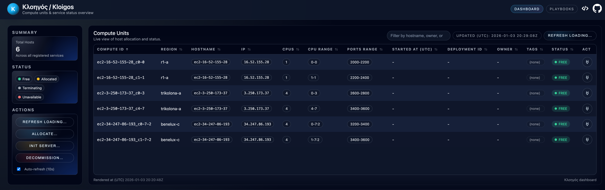

---
hide:
  - navigation
  - toc
---

# Linux-native bare-metal Platform as a Service

## Kloigos provides VM-like application isolation using standard Linux primitives, without virtualization or containers

---

Kloigos is a Linux-native Platform as a Service for bare-metal infrastructure. It provides a curated
execution platform for Linux applications running on shared physical servers.

Instead of virtualizing hardware or requiring applications to be packaged as containers, Kloigos
assembles proven Linux capabilities into isolated application environments called **Compute Units**.
Each Compute Unit shares the host kernel while receiving dedicated CPU resources, memory limits,
storage ownership, networking, and a Linux user identity.

Kloigos is designed for teams that want the operational feel of a small VM - SSH access, writable
directories, predictable resources, and user-managed `systemd --user` services - without a hypervisor,
container runtime, image pipeline, or orchestration layer.

---

### What Kloigos Builds On

Kloigos intentionally does not invent new low-level isolation technologies. It integrates:

- systemd and cgroups for resource management
- nftables for network isolation
- Linux users and filesystem permissions for identity and storage isolation
- LVM for logical storage management
- AppArmor profiles for mandatory access control on supported hosts
- standard Linux networking for floating IP management

The result is a consistent platform model that lets infrastructure teams partition powerful servers
into isolated application environments while preserving native Linux performance and familiar
operational tools.

### Capacity and Identity

Kloigos separates host capacity from workload identity.

A **Compute Unit** represents capacity on a host: CPU allocation, memory limits, NUMA placement, and
local storage.

An **Allocation** represents a workload identity: allocation ID, Unix login user, IP address, storage,
metadata, tags, and current Compute Unit placement.

This separation allows workloads to scale or move while preserving their user, IP address, storage
identity, and metadata. Only placement changes.

---

### License

Kloigos is an open-source project licensed under the **Apache License 2.0**. All features are part of
the open-source distribution.
